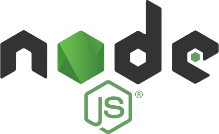
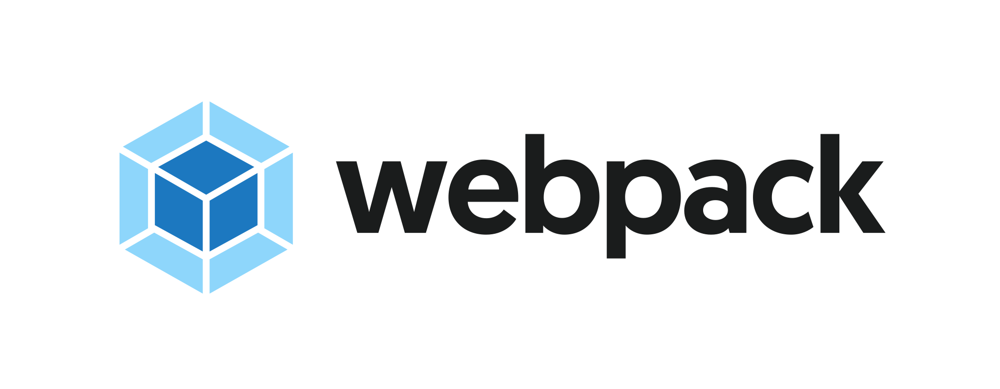

# node-template
Minimum boilerplate template for front-end applications built with node

## Getting Started
1. Clone this repository and install the node dependecies with:
    ```
    npm install
    ```
2. The default server is set to [`Express`](https://expressjs.com/) and can be started with:
    ```
    npm start
    ```
    **Note:** An unset `NODE_ENV` variable will default to `production` for both Webpack bundling and Express hosting.
3. Open [`localhost:8080`](localhost:8080) to view the production instance of the server.

    **Note:** Open [`localhost:3000`](localhost:3000) to if you have set `NODE_ENV` to `development`

## Development Environments
### Mac OSX (Zsh)
1. Set the `NODE_ENV` variable into your `.zshenv` file with the command:
    ```
    echo 'export NODE_ENV=development' >> ~/.zshenv
    ```
2. Then reload the changes to the file with:
    ```
    source ~/.zshenv
    ```
3. Test that the environment variable has been correctly set with:
    ```
    echo $NODE_ENV
    ```

### Windows 10
* #### Powershell

  Use Powershell set `NODE_ENV` variable to `development` with:
  ```
  $env:NODE_ENV="development"
  ```
  **Note:** This value will not persist after you close the terminal.

* #### System Variables
  
  To persist the `NODE_ENV` after closing Powershell follow these steps:
  1. Type in `environment` into the search bar and open the dialog box for `System Properties` and under `Advanced` click on `Environment Variables`
  2. Under the `System variables`, click the `New...` button to create an environment variable with the values:
      ```
      Variable name: NODE_ENV
      Variable value: development
      ```
      **Note:** If you work on a shared machine, you should probably add the variable to `User variables` instead of `System variables`.
  3. After entering these values make sure to exit by **clicking** `OK` otherwise the changes will not save.
  4. Restart Windows to use the updated environment variables.

## Backends
### Default (Express)
1. The express backend is already configured to serve static files from `public/` but you can change the values of the webpack output path and express static folder in `app.json`.
    ```
    {
      "express": {
        "output": {
          "path": "./public/js"
        },
        "static": "public"
      }
    } 
    ```

### Seperate Local (i.e. Flask, Django, etc.)
1. The frontend and backend repositories should share the same parent directory
    * Set output directory for backend in `app.json` under `local.output.path`
      ```
      {
        "local": {
          "output": {
            "path": "../backend-repository/static"
          }
        }
      } 
      ```
    * Folder structure should look something like this:
      ```
      GitHub
      ├── backend-repository
      └── frontend-repository
      ```
2. After updating those configurations, run  to build with webpack and watch for changes with:
    ```
    npm run build-local-watch
    ```
    * Build the webpack bundle to the same directory **without** watching for changes with 
      ```
      npm run build-local
      ```

3. You may need to reload bundle updates with a hard refresh <kbd>command</kbd> / <kbd>Ctrl</kbd> + <kbd>shift</kbd> + <kbd>R</kbd> to load changes.
    * Webpack will continue to watch for changes, but you will typically need to hard refresh the browser to tell the server to send the updated bundle file.

## Packaging
1. Login to npm within your command line interface with the command:
    ```
    npm login
    ```
2. Make sure that you have updated the package corresponding values in the `package.json` file.
    ```
    {
      "name": "replace-me-with-your-repository-name",
      "version": "1.0.0",
      "description": "replace-me-with-your-repository-description",
      "author": "replace-me-with-your-name"
      ...
    }
    ```
    **Note:** The `name` parameter is how npm will reference your package when installing.

### Initial Publishing
Once you have logged in and updated the `package.json` values, you can publish your package with:

```
npm publish
```
  * This command will run `prepublishOnly` script and then publish to npm afterwards.

### Updating
1. Update the source files as you would and create and push out a commit for these changes.
2. Once you have pushed those changes and you branch is up to date, you can update your package version with the following commands:
    * Patch Release (1.0.1 -> 1.0.2):
      ```
      npm version patch
      ```
    * Minor Release (1.1.0 -> 1.2.0):
      ```
      npm version minor
      ```
    * Major Release (1.0.0 -> 2.0.0):
      ```
      npm version major
      ```
    Note: Running these commands will also create a new commit

3. After updating the package version, publish these updates with:
      ```
      npm publish
      ```